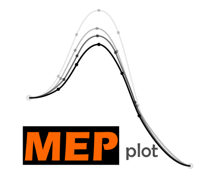
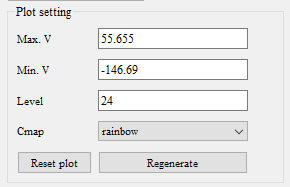
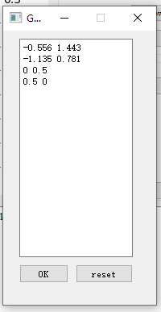
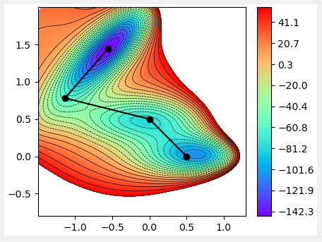
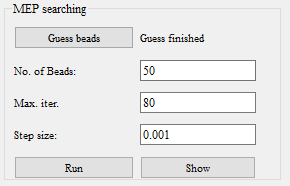
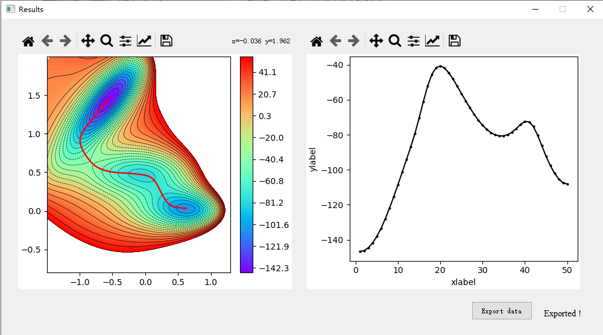

# MEPplot
 [English](README.md)  [中文](README_CN.md)

<a href="https://explosion.ai"></a>

潜在的なエネルギー面（自由エネルギー面）に最小エネルギーの経路を描くプログラム。 このプログラムはstring法に基づいています(string method)。 詳細については、以下の論文を参照してください。 (Phys. Rev. B **66**, 052301 – Published 12 August 2002) 

## ダウンロードダウンロード安装

次のリンクにあります `.rar` ファイル：

https://github.com/chenxin199261/MEPplot/releases

中国本土のユーザー向け (GitHub非常に遅い), ダウンロードするには、次のリンクを使用してください:

https://n459.com/file/30374101-473325811 （passwd:111111）

ダウンロードrarファイルと解凍， 次の3つのファイルを取得します，

* MEPplot.bat :MEPplotプログラムエントリ、実行可能なスクリプト,実行可能なスクリプト
* example: 潜在的なエネルギー表面テンプレート.
* main: プログラムファイル.

## 使用法

スクリプトファイルをクリックします `MEPplot.bat`。 次のインターフェイスが表示されます。ガイドに従ってステップバイステップで描画を完了してください。


#### 1.潜在的なエネルギー表面データファイルを準備します

2Dポテンシャルエネルギーサーフェスファイルは、厳密な形式に従う必要があります，ファイルには3つの列（X座標、Y座標、エネルギー）が含まれています。次のように：

```
  -0.88235    1.99224   30.64485
   1.23646   -0.78346  420.58113
   1.03326    0.21343   18.23895
  -1.28864    1.87634   23.34170
   0.22373    0.08548  -79.56263
   0.97433    0.60216  119.97031
   0.03879   -0.50717   55.13104
...
```

テンプレートは、サンプルフォルダにもあります。

#### 2. PESデータファイルをロードして2DPESをプロットします

クリック `Open...` 右上隅のボタン PESデータファイルを選択します. PESはで表示されます `plot window` すぐに. 自動生成されたプロットは、最小点と鞍点を見つけるのに完全ではない場合があります. ユーザーは、関連するパラメータを調整する必要があります `PES plot control` パネル. 



* **Max. V**: カウントプロットの最大値. より大きい値 *Max. V* 選別されます. 
* **Min. V**: 最小値. より小さい値 *Min. V* 選別されます (調整しないでください。調整しないと、ローカルミニマを見逃してしまいます).
* **Level**: PESにプロットされた等高線の数. 
* **Cmap**：カラーマップスタイル.

クリック `Regenrate` ボタン新しいPESの図が表示されます. プロットの設定を台無しにした場合, クリックするだけ `Reset plot`. 


#### 3. 最小エネルギー経路を検索する

まず、 ユーザーは最初の推測を提供する必要がありますストリング。 正確な初期推定ストリングは、最終結果にすばやく最適化できます。 最初の推測はビーズ（少なくとも2つのビーズ）によって定義されます。 クリック `Guess beads` 座標（XとY）をダイアログボックスに入力し、




この例では、最初のストリングを定義するために4つのビーズが連続して提供されています。 「OK」をクリックすると、最初の推測文字列がPESに黒い実線でプロットされます。



プログラムは、最適化パラメーターのデフォルト値を提供します。直接使用できます。収束に失敗した場合は、最適化のためにパラメーターを調整できます。 



* **No. of Beads**: ビーズの数。文字列のビーズの数を定義します。より多くのビーズより多くの精度。 
* **Max. iter**: 最大反復回数。最適化ステップが。 最大反復回数。最適化ステップが Maxを超える場合。 iter 値の場合、プロセスは停止します。
* **Step size**:  *Step size* 値は、勾配の降順のステップサイズを決定します。


クリック `Run` ボタン、 最適化プロセスが開始されます。 次に、最初の推測文字列が最小エネルギーパスに最適化されます。 最適化プロセスは、プロットウィンドウで視覚化できます。ログパネルの `Converged !` メッセージは、最適化が成功したことを意味します。


#### 4. 結果を示す

最終的に、クリック `Show` ボタン に `MEP searching` パネル。最終結果が表示されます。 

 

クリック`Export data` ボタン、 ビーズの座標とMEPの関連エネルギーは、さらに使用するためにファイルにエクスポートできます。


## チップ

1. 最初の推測ビーズは、1回の最適化プロセスの後、最新の最適化されたビーズに更新されます。収束に失敗した場合、ユーザーは[実行]をクリックして直接実行できます。クリックする必要があります `Guess beads` 新しい初期推測を生成します。
2. 弦が振動する場合、 削減してみてください `step size` 値。
3. ストリング上のビーズがゆっくり動く場合、増加してみてください `step size`  値。
4. 負`step size`値取得する *maximum energy path*

